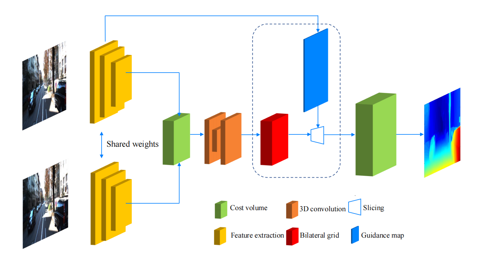

## BGNet

This repository contains the code for our CVPR 2021 paper `Bilateral Grid Learning for Stereo Matching Network` [[BGNet](https://arxiv.org/pdf/2101.01601.pdf)] 




### Environment

1. Python 3.6.*
2. CUDA 10.1
3. PyTorch 1.7.1
4. TorchVision 0.8.2

### Dataset
To evaluate/train our BGNet network, you will need to download the required datasets.

* [SceneFlow](https://lmb.informatik.uni-freiburg.de/resources/datasets/SceneFlowDatasets.en.html)
* [IRS](https://pan.baidu.com/s/1VKVVdljNdhoyJ8JdQUCwKQ#list/path=%2F)
* [KITTI2015](http://www.cvlibs.net/datasets/kitti/eval_scene_flow.php?benchmark=stereo)
* [KITTI2012](http://www.cvlibs.net/datasets/kitti/eval_stereo_flow.php?benchmark=stereo)
* [Middlebury 2014](https://vision.middlebury.edu/stereo/submit3/)

### Pretrained model

We provide seven pretrained model under the folder [models](./models) .

### Evaluation

We provided  a script to get the kitti benchmark result,check [predict.sh](./predict.sh) for an example usage.

### Prediction

We  support predicting on any rectified stereo pairs. [predict_sample.py](./predict_sample.py) provides an example usage.


### Acknowledgements
Part of the code is adopted from the previous works: [DeepPruner](https://github.com/uber-research/DeepPruner), [GwcNet](https://github.com/xy-guo/GwcNet), [GANet](https://github.com/feihuzhang/GANet) and [AANet](https://github.com/haofeixu/aanet). We thank the original authors for their contributions.

### Citing
If you find this code useful, please consider to cite our work.

```
@inproceedings{xu2021bilateral,
  title={Bilateral Grid Learning for Stereo Matching Networks},
  author={Xu, Bin and Xu, Yuhua and Yang, Xiaoli and Jia, Wei and Guo, Yulan},
  booktitle={Proceedings of the IEEE/CVF Conference on Computer Vision and Pattern Recognition},
  pages={1--10},
  year={2021}
}
```

